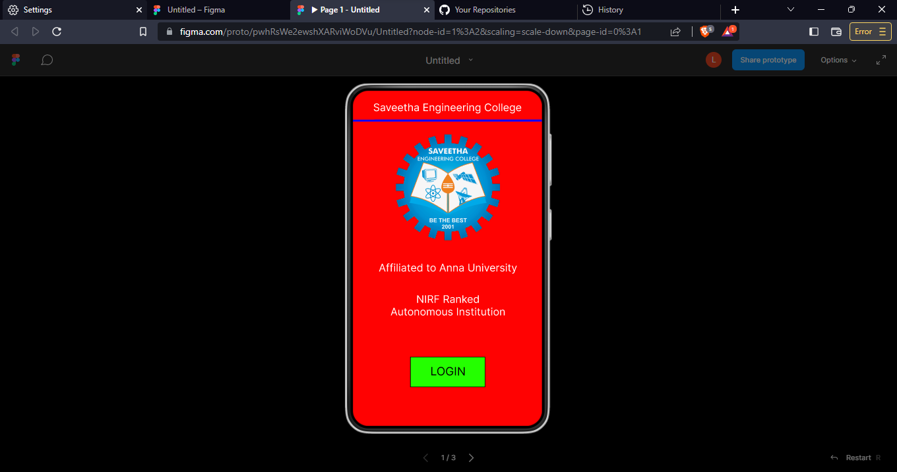
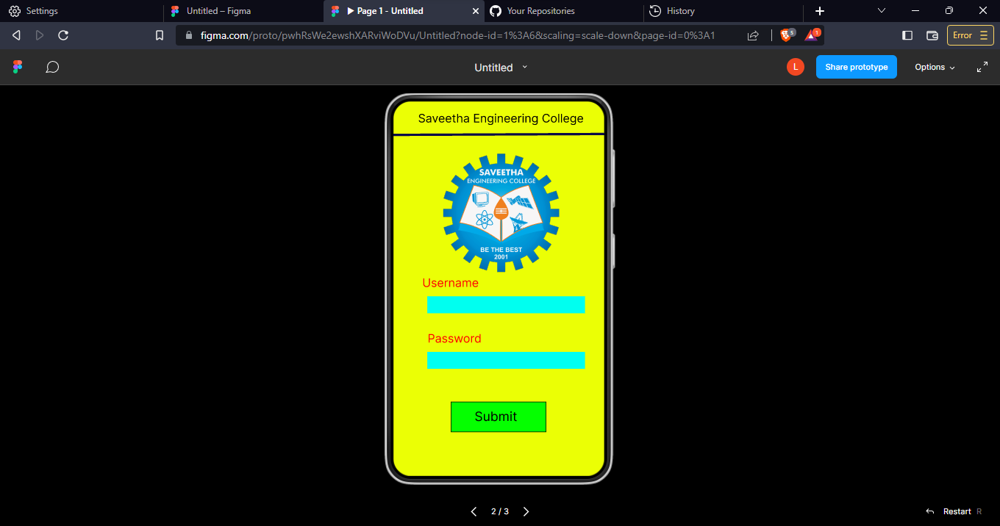
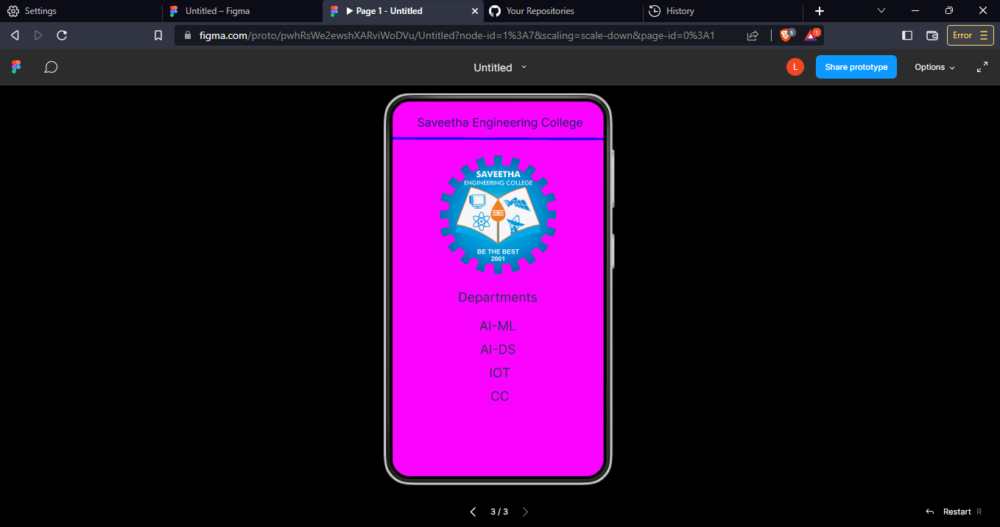

# Event Registration Web Application

## AIM:
To design, develop and deploy a web application for event registration.

## DESIGN STEPS:

### Step 1:
Create a new frame.

### Step 2:
Select any one preset size of your choice.

### Step 3:
Select the shapes you need.

### Step 4:
Import images as needed.

### Step 5:
Create pages based on your need and link them.

### Step 6:

Validate the HTML and CSS code.

### Step 6:

Publish the website in the given URL.

## DESIGN TOOL:
Figma

## CODE:


## OUTPUT:
```
/* Affiliated to Anna University */


position: absolute;
width: 338px;
height: 44px;
left: 12px;
top: 326px;

font-family: 'Inter';
font-style: normal;
font-weight: 400;
font-size: 20px;
line-height: 24px;
text-align: center;

color: #FFFFFF;


/* Saveetha Engineering College */


position: absolute;
width: 338px;
height: 44px;
left: 11px;
top: 20px;

font-family: 'Inter';
font-style: normal;
font-weight: 400;
font-size: 20px;
line-height: 24px;
text-align: center;

color: #FFFFFF;


/* NIRF Ranked Autonomous Institution */


position: absolute;
width: 338px;
height: 44px;
left: 12px;
top: 386px;

font-family: 'Inter';
font-style: normal;
font-weight: 400;
font-size: 20px;
line-height: 24px;
text-align: center;

color: #FFFFFF;


/* Line 1 */


position: absolute;
width: 360.01px;
height: 0px;
left: 0px;
top: 59.1px;

background: #5404FF;
border: 4px solid #1703FF;
transform: rotate(-0.03deg);


/* Rectangle 1 */


box-sizing: border-box;

position: absolute;
width: 143px;
height: 58px;
left: 109px;
top: 508px;

background: #24FF00;
border: 1px solid #000000;


/* LOGIN */


position: absolute;
width: 180px;
height: 31px;
left: 91.16px;
top: 521px;

font-family: 'Inter';
font-style: normal;
font-weight: 400;
font-size: 22px;
line-height: 27px;
text-align: center;

color: #000000;

transform: rotate(0.3deg);


/* image 1 */


position: absolute;
width: 198px;
height: 203px;
left: 82px;
top: 83px;

background: url(image.png);

/* Line 2 */


position: absolute;
width: 360.07px;
height: 0px;
left: -0.03px;
top: 59.28px;

border: 4px solid #0C0B48;
transform: rotate(-0.25deg);


/* Saveetha Engineering College */


position: absolute;
width: 307px;
height: 31px;
left: 30px;
top: 17px;

font-family: 'Inter';
font-style: normal;
font-weight: 400;
font-size: 20px;
line-height: 24px;
text-align: center;

color: #000000;


/* Rectangle 2 */


position: absolute;
width: 269px;
height: 29px;
left: 58px;
top: 333px;

background: #00FFF0;


/* Rectangle 3 */


position: absolute;
width: 269px;
height: 29px;
left: 58px;
top: 428px;

background: #00FFF0;


/* Password */


position: absolute;
width: 141px;
height: 31px;
left: 34px;
top: 393px;

font-family: 'Inter';
font-style: normal;
font-weight: 400;
font-size: 20px;
line-height: 24px;
text-align: center;

color: #FF0000;


/* Username */


position: absolute;
width: 141px;
height: 31px;
left: 27px;
top: 298px;

font-family: 'Inter';
font-style: normal;
font-weight: 400;
font-size: 20px;
line-height: 24px;
text-align: center;

color: #FF0000;


/* Rectangle 2 */


box-sizing: border-box;

position: absolute;
width: 163px;
height: 52px;
left: 98px;
top: 513px;

background: #05FF00;
border: 1px solid #000000;


/* Submit */


position: absolute;
width: 172px;
height: 21px;
left: 89px;
top: 524px;

font-family: 'Inter';
font-style: normal;
font-weight: 400;
font-size: 22px;
line-height: 27px;
text-align: center;

color: #000000;


/* image 2 */


position: absolute;
width: 198px;
height: 203px;
left: 85px;
top: 89px;
background: url(image.png);

/* Saveetha Engineering College */

position: absolute;
width: 323px;
height: 42px;
left: 22px;
top: 24px;
font-family: 'Inter';
font-style: normal;
font-weight: 400;
font-size: 20px;
line-height: 24px;
text-align: center;
color: #111968;

/* Line 3 */

position: absolute;
width: 360px;
height: 0px;
left: 0px;
top: 65px;
border: 4px solid #1602FF;
transform: rotate(0.16deg);

/* Departments */

position: absolute;
width: 219px;
height: 40px;
left: 70px;
top: 320px;
font-family: 'Inter';
font-style: normal;
font-weight: 400;
font-size: 22px;
line-height: 27px;
text-align: center;
color: #1F3359;

/* AI-ML */
position: absolute;
width: 219px;
height: 40px;
left: 70px;
top: 369px;
font-family: 'Inter';
font-style: normal;
font-weight: 400;
font-size: 22px;
line-height: 27px;
text-align: center;
color: #1F3359;

/* AI-DS */
position: absolute;
width: 219px;
height: 40px;
left: 58px;
top: 409px;
font-family: 'Inter';
font-style: normal;
font-weight: 400;
font-size: 22px;
line-height: 27px;
text-align: center;
color: #1F3359;

/* IOT */

position: absolute;
width: 219px;
height: 40px;
left: 58px;
top: 449px;

font-family: 'Inter';
font-style: normal;
font-weight: 400;
font-size: 22px;
line-height: 27px;
text-align: center;

color: #1F3359;


/* CC */


position: absolute;
width: 219px;
height: 40px;
left: 58px;
top: 489px;

font-family: 'Inter';
font-style: normal;
font-weight: 400;
font-size: 22px;
line-height: 27px;
text-align: center;

color: #1F3359;


/* image 3 */


position: absolute;
width: 198px;
height: 203px;
left: 81px;
top: 92px;

background: url(image.png);
```

## OUTPUT:




## RESULT:
The program to design, develop and deploy a web application for event registration is completed successfully.